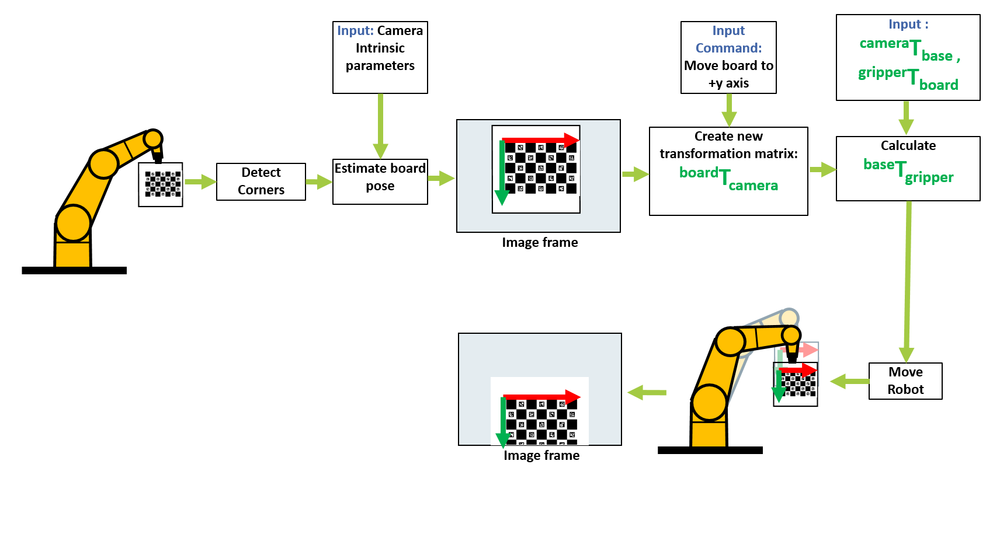

# Vision_Guided_Robot_Movement
Visual Servoing, also known as Vision-Based Control, is a technique used
in robotics and automation where visual information from a camera is utilized to control
the motion of a robot or a robotic system. 
This repository explains the procedure of moving a charuco board in different position and orientation. 
<p align="center">
  
  
  
 </p>

# Methodology
<p align="center">
  
 </p>
 
```
ZB = matrix.transform(base_wrt_camera, camera_wrt_board)
gripper_wrt_base = np.linalg.inv(matrix.transform(ZB, board_wrt_gripper))
```

 
## Requirements
- python 3.8
- opencv 4.2
- ROS (Noetic)
- multical
- scipy
- scikit-learn
- numpy 1.23.4
- matplotlib 3.1.0
- plotly

## Usage
- git clone https://github.com/TabassumNova/Multi_Camera_Calibration.git
- Build catkin workspace
- Source the workspace
- Run main1 function from [handEye_final.py](https://github.com/TabassumNova/Multi_Camera_Calibration/blob/main/tx60l_moveit_config/image_acquisition_automation/src/multical_scripts/handEye_final.py). It will create transformation of one camera wrto one board.
- Run [main_viz.py](https://github.com/TabassumNova/Multi_Camera_Calibration/blob/main/tx60l_moveit_config/image_acquisition_automation/main_viz.py) which will open the user interface.
- Click the "View_Plan" tab


# View plan tab
 <p align="center">
  
 </p>

- Click the ’Directory’ Button: Start by clicking the ’Directory’ button. This 
button allows you to select the directory where the images will be saved.
- Find Cameras: Next, click on the ’Find Cameras’ button. This action will reveal
the list of cameras currently available.
- Show Next Image: Press the ’Show Next Image’ button. This will display the
current frames from all connected cameras in the image widget.
- Save Pose: To save the current pose, click the ’Save Pose’ button. This step records
the robot’s current position.
- Home Position: The ’Home Position’ button is used to move the robot’s joints
back to their previously saved angles.
- Choose a Camera: Now, select a camera by clicking the checkbox next to its
name. This selection will generate checkboxes displaying the names of boards that
are detectable in the current frame of the chosen camera.
- Detect Boards: Click on the ’Detect Boards’ button. This action will reveal the
rotation and translation vectors associated with the chosen board.
- Adjust Vectors: You can fine-tune the rotation and translation vectors by clicking
the plus or minus buttons, allowing for precise adjustments.
- Start Motion: After selecting the desired random pose, press the ’Start Motion’
button. If the calculated motion is feasible, the information box will display ”Transformation found,” and the robot will move to the calculated position.
